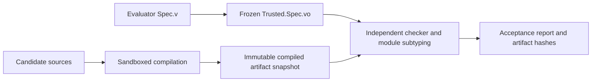

# Checking AI-generated programs and proofs

An evaluator writes a normal `Spec.v` containing a module type named `SOLUTION`.
The AI submits `Candidate.v`, exporting a module named `Implementation`. The
acceptance gate independently checks the compiled libraries and asks Rocq's
kernel whether the submitted module satisfies the frozen signature.

The candidate controls its program, proof scripts, helper source files, notation,
and compiler diagnostics. It does not control the specification, axiom policy,
toolchain, build commands, kernel gate, or namespace mappings used for acceptance.

This is implemented for **Rocq 9.3.0 on Linux**, with **Rocq Stdlib 9.2.0** and
**stdpp 1.13.0**, pinned in [coqcp-toolchain.opam](../coqcp-toolchain.opam).
The internal module-checking API is
version-specific; another version requires an explicit port and regression run.
There is no silent fallback to another version or to unsandboxed compilation.

## Installation

On Ubuntu 26.04, install the pinned opam toolchain in `/opt/rocq/9.3.0`:

```sh
sudo apt-get update
sudo apt-get install ca-certificates curl git python3 build-essential ocaml opam libgmp-dev pkg-config m4 rsync unzip libseccomp-dev bubblewrap
sudo install -d -o "$(id -un)" -g "$(id -gn)" /opt/rocq
bash tools/install-toolchain.sh
export PATH=/opt/rocq/9.3.0/bin:$PATH
rocq --version
rocq makefile -f _CoqProject -o Makefile
make clean
make -j2
python3 tools/adversarial/check.py build
```

Use a regular, non-root OS user for preparation and submission checking. Root
bypasses Linux's process-count resource limit, so the runner rejects root.
Installation can use `sudo`. No privileges are requested by the checker.

Bubblewrap must support user, mount, PID, network, IPC, and UTS namespaces, and
seccomp must be available. A host policy that prevents namespace creation causes
the job to fail. An administrator must configure a suitable worker host; the
checker never disables host protections automatically. This profile expects
system tools under `/usr` and the dedicated Rocq toolchain under
`/opt/rocq/9.3.0`, rather than a snap, an opam switch in a home directory,
macOS, or Windows. Only installed runtime directories from that switch are
mounted; opam state, downloads, and build logs are excluded.

Upgrading the toolchain invalidates existing frozen bundles. Rebuild the project
and the gate, prepare each specification again, and record the new evaluator ID.

## Write the specification

The small example [Increment.v](../verification/specs/Increment.v) is:

```coq
From CoqCP Require Import Options.

Definition required (program : nat -> nat) : Prop :=
  forall input, program input = S input.

Module Type SOLUTION.
  Parameter program : nat -> nat.
  Parameter correct : required program.
End SOLUTION.
```

`program` and `correct` are mandatory signature fields. Additional fields are
supported by Rocq's ordinary module subtyping. The signature itself and the
submitted implementation must not be unapplied functors. Helper functors are
allowed and their stored bodies are audited.

`Parameter` inside a module type expresses an interface requirement. It does not
add a global axiom when a concrete implementation supplies that field. In
contrast, an implementation that simply declares its program or admits its proof
introduces assumptions, which the policy rejects by default.

For competitive programs, specify successful execution and the complete output
stream. A statement that only constrains output _if execution succeeds_ can let
an always-failing program satisfy the requirement. Keep input bounds and memory
semantics on the trusted side too. For interactive programs, require the exact
flush snapshots as well.
[PermutedBinaryStringsIO.v](../verification/specs/PermutedBinaryStringsIO.v)
binds the program to the generated entry point and requires successful full
execution with all query/reply boundaries; see
[End-to-end verification](EndToEndVerification.md).

## Freeze the evaluator's specification

```sh
python3 tools/adversarial/check.py prepare \
  --spec verification/specs/Increment.v \
  --bundle .verification/increment-bundle
```

Preparation snapshots the project's registered compiled libraries, renames the
specification to `Trusted.Spec`, compiles it in the sandbox, and independently
checks its dependency closure. The bundle contains:

- `spec/Spec.v` and `spec/Spec.vo`;
- the compiled project libraries under their existing logical namespaces;
- `manifest.json`, containing SHA-256 file hashes, the toolchain fingerprint,
  exported interface identities, the axiom policy, and the baseline audit.

Build the trusted project libraries before preparation. Their compiled `.vo`
files are evaluator-controlled inputs; this command does not rebuild the whole
repository or certify the correspondence of those files to their source text.

The command prints JSON with a `spec_id`. **Record that ID in evaluator-controlled
storage.** It is the SHA-256 hash of the manifest. The checking command requires
that original ID; accepting an ID supplied by the candidate would let the
candidate substitute a different bundle and recompute its hashes.

By default, the allowed axiom set is empty (`--axiom-policy none`). An evaluator
can instead select the exact set already trusted by project CI:

```sh
python3 tools/adversarial/check.py prepare \
  --spec verification/specs/KnapsackIO.v \
  --bundle .verification/knapsack-io-bundle \
  --axiom-policy ci
```

The shared policy is [trusted_axioms.json](../verification/trusted_axioms.json).
Its only current entry is
`Stdlib.Logic.FunctionalExtensionality.functional_extensionality_dep`.
Both the project `rocq check` CI job and the submission checker reject every axiom
outside this set. There is no option to supply an arbitrary name or regex.
The kernel gate embeds the same fixed set at build time and also rejects
unapproved names when invoked directly. Names refer to declarations in the
frozen specification and fingerprinted system libraries.

Policy changes require a reviewed change to the trusted CI infrastructure,
rebuilding the gate, and freezing new specification bundles. Evaluators must
use their approved infrastructure revision; a candidate's policy file is not
an authority. Allowed axioms remain logical assumptions, not proof obligations
that the tool discharges. Reports list the axioms actually encountered, which
may be a subset of the selected policy.

Rocq 9.3 also reports inductives that rely on its default treatment of indices
when generating universe constraints. The shared policy records the six existing
declarations reported by project CI: `eq_true`, `eq`, `if_spec`, `eq_dep`, `null`,
and `TCEq`, each under its fully qualified trusted library name. The kernel gate
embeds this set too and rejects further declarations with that property.
This records the behaviour of the pinned standard libraries, including ordinary
equality. The `none` policy excludes axioms while retaining these base theory
declarations. Changing this set also requires rebuilding and freezing new bundles.

## Submit a program and proof

A submission is a dedicated directory containing only top-level `.v` files,
including `Candidate.v`. Names must be ASCII Rocq identifiers. Symlinks, special
files, subdirectories, precompiled libraries, project files, and build scripts
are rejected. At most 64 sources and 8 MiB of source text are accepted.

For the increment contract, `Candidate.v` can contain:

```coq
From CoqCP Require Import Options.
Require Trusted.Spec.

Module Implementation.
  Definition program : nat -> nat := S.
  Lemma correct : Trusted.Spec.required program.
  Proof. intro input. reflexivity. Qed.
End Implementation.
```

Helper files are compiled under `Submission`, and can be required with names
such as `Submission.Helper`. The build worker uses `rocq dep` to order the submitted
sources and invokes `rocq compile` directly. It never invokes a submitted Makefile,
`_CoqProject`, shell command, or package-install script.

The AI can develop against a copy of the specification. The evaluator must keep
its bundle and recorded ID outside the AI's writable submission environment.

## Check a submission

Use the specification ID printed during preparation:

```sh
python3 tools/adversarial/check.py check \
  --bundle .verification/increment-bundle \
  --spec-id YOUR_RECORDED_SPEC_ID \
  --submission verification/examples/increment \
  --output .verification/increment-result
```

Bundle and result directories must be new when they are created. Choose fresh
names for subsequent runs; the tool refuses to overwrite previous artifacts.

The checking command prints a JSON report and exits zero only for acceptance.
Once a result directory is created, it stores `report.json`, the submitted source
snapshot, and any compiled `.vo` artifacts. Admission failures such as an invalid
bundle ID print rejection JSON without creating a result directory. Reports
include the specification ID, source and artifact hashes, toolchain fingerprint,
resource limits, actual axioms, and the stage at which a failure occurred.

The certificate concerns the **compiled module artifacts identified by those
hashes**. Compiler logs and pretty-printed statements are never evidence of
acceptance. Source hashes provide provenance; they are not a separate proof that
an arbitrary compiler or plugin faithfully translated the source text.

## How the gate avoids notation deception



The kernel gate is [spec_check.ml](../tools/adversarial/spec_check.ml). It links
`rocq-runtime.checklib`, the same compiled-library loader and checker used by
`rocq check`, plus Rocq's module subtyping implementation. It does not link the
vernacular interpreter or load candidate ML plugins.

In a fresh process, the gate:

1. Registers only evaluator-controlled logical load paths.
2. Calls `Check.recheck_library` on `Trusted.Spec`, `Submission.Candidate`, and
   **every submitted helper library**, with empty `admit` and `norec` lists.
3. Rechecks opaque proof bodies with VM and native conversion disabled.
4. Audits global declarations and stored module/functor bodies for unapproved
   axioms, disabled guard/positivity/universe/elimination checks, inductives
   outside the CI set for indices not mattering, impredicative Set,
   definitional UIP, and rewrite rules. Signature parameters are distinguished
   from implementation assumptions; sealed module bodies are examined too.
5. Constructs the canonical module paths `Trusted.Spec.SOLUTION` and
   `Submission.Candidate.Implementation` directly, without looking them up in
   candidate short-name or notation tables.
6. Calls `Subtyping.check_subtypes` with Rocq's checked universe conversion.

The comparison uses kernel conversion and ordinary module subtyping. It does not
compare strings, pretty-printed syntax, proof names, or an AI's explanation.
Extra implementation fields are allowed. Missing fields, a proof about another
program, and an extra unprovided premise fail the required field checks.

For example, a submission may introduce:

```coq
Notation "'required' p" := True (at level 10).
```

It can then prove its fake requirement, but the gate still compares against the
original compiled signature. The regression suite demonstrates rejection of this
case and of namespace shadowing.

## Sandbox and resource boundaries

[check.py](../tools/adversarial/check.py) supervises Bubblewrap processes.
[worker.py](../tools/adversarial/worker.py) is an evaluator-controlled build
worker. [sandbox_exec.c](../tools/adversarial/sandbox_exec.c) applies resource
limits and a libseccomp filter before executing each parser, compiler, or kernel
gate process.

Both compilation and independent checking run with:

- separate user, PID, mount, network, IPC, and UTS namespaces;
- all capabilities dropped, no new privileges, and further user namespaces
  disabled;
- a cleared environment, isolated temporary home, and no Rocq startup script;
- read-only system runtime directories, narrowly selected OCamlfind
  configuration, specification bundles, tool binaries, and source/artifact inputs;
- no host home directory, repository mount, credentials, or host network;
- read-only root filesystem, a bounded writable `/work` tmpfs, and a 16 MiB
  `/tmp` tmpfs;
- denied process forks, sockets, namespace changes, mounts, tracing,
  cross-process memory access, signaling of the build supervisor, and privileged
  kernel APIs; OCaml runtime threads are allowed;
- a build supervisor protected against child access through `/proc` by disabling
  dumpability.

The worker sends artifact bytes back to the coordinator. It does not bind a
writable host directory into the sandbox. Unexpected file names, symlink outputs,
oversized artifacts, and malformed artifact messages are rejected. After the
compiler exits, a separate checker sandbox receives the artifacts read-only.

Default limits are:

| Resource                                              |     Default | CLI option           |
| ----------------------------------------------------- | ----------: | -------------------- |
| Wall time per compilation or checking stage           | 120 seconds | `--wall-seconds`     |
| CPU time per process                                  |  60 seconds | `--cpu-seconds`      |
| Virtual address space per process                     |    2048 MiB | `--memory-mib`       |
| Writable work tmpfs                                   |     256 MiB | `--work-mib`         |
| Individual output file and total retained `.vo` bytes |      64 MiB | `--artifact-mib`     |
| Compiler diagnostics / checker output                 |       1 MiB | `--log-mib`          |
| Open file descriptors per tool process                |         128 | fixed                |
| Tasks for the evaluator's OS user per tool process    |         256 | fixed `RLIMIT_NPROC` |

The CPU and memory limits are per process, not a cgroup-wide accounting promise.
The trusted worker compiles sequentially and compiler children cannot fork.
`RLIMIT_NPROC` is shared with other jobs running under the same host user, so a
dedicated evaluator user avoids interference. The outer wall timer kills the
sandbox process group; destroying its PID namespace also removes its descendants.
A resource-limit rejection means the attempt was not certified, not that its
mathematical statement is false.

For a public service, add admission rate limits, bounded job concurrency,
artifact retention limits, and worker lifecycle management outside this runner.
Run workers on patched, disposable machines and keep the evaluator's OS,
toolchain, driver, and expected specification IDs trusted. This sandbox reduces
the submission's access; it does not establish correctness of the Linux kernel
or eliminate vulnerabilities in the trusted checker.

## Shipped contracts and checks

The examples exercise different interfaces:

| Specification                                                                | Submitted example                                  | Guarantee                                                                                                                                |
| ---------------------------------------------------------------------------- | -------------------------------------------------- | ---------------------------------------------------------------------------------------------------------------------------------------- |
| [Increment.v](../verification/specs/Increment.v)                             | `verification/examples/increment`                  | Total successor function; no axioms                                                                                                      |
| [Knapsack.v](../verification/specs/Knapsack.v)                               | `verification/examples/knapsack`                   | Optimal value among feasible item sublists; no axioms                                                                                    |
| [KnapsackIO.v](../verification/specs/KnapsackIO.v)                           | `verification/examples/knapsack-io`                | Successful execution and exact decimal output with newline, under the existing arithmetic bounds; functional extensionality allowed      |
| [PermutedBinaryStringsIO.v](../verification/specs/PermutedBinaryStringsIO.v) | `verification/examples/permuted-binary-strings-io` | Generated entry point, successful complete execution, exact bytes and all query/final flush snapshots; functional extensionality allowed |

Run the acceptance and containment regression suite:

```sh
python3 -m unittest discover -s tools/adversarial/tests -v
```

Run all shipped contracts and retain their bundles, reports, and artifacts:

```sh
python3 tools/adversarial/examples.py --output .verification/example-results
```

The suite covers valid and alternate programs, helper dependency ordering,
notation and namespace deception, extra premises, missing fields, abstract and
functor implementations, the shared CI axiom policy, arbitrary policy rejection,
admitted and unused axioms, weaker decoder and unobserved execution certificates,
unsafe definitions inside unused functors, corrupted libraries, bundle and
manifest tampering, symlinks, precompiled submissions, and sandbox filesystem,
network, fork, timeout, CPU, memory, output, and disk limits. Missing sandbox
support and root execution fail closed.

[The CI workflow](../.github/workflows/adversarial.yml) builds trusted project
libraries, runs the regressions, checks the examples, and uploads the resulting
bundles and certificates. Its outer container permits namespace creation; all
submitted tools execute inside the inner restricted sandbox as a non-root OS
user. These CI regressions check the infrastructure in the proposed commit. A
production evaluator must use its own approved revision, rather than running
the submitting AI's proposed checker, workflow, or specification modifications.

## What a certificate does and does not establish

The gate establishes that the checked compiled module satisfies the frozen
formal specification under its recorded logical assumptions. Specification
review remains necessary, especially when an AI also writes `Spec.v`: an
incorrect model, impossible precondition, or incomplete contract can be proved.

The input/output example checks the repository's Coq execution model. It does
not certify the corresponding generated C++, the TypeScript code generator,
allocation behavior of the host runtime, or a separately supplied executable.
Connecting a certificate to a native executable requires a verified compiler,
checked translation certificates, or an explicitly trusted translation and
build chain that records the relationship to the accepted artifact hashes.

Useful upstream references:

- [Rocq module signatures and subtyping](https://rocq-prover.org/doc/V9.3.0/refman/language/core/modules.html)
- [Compiled-library checker](https://rocq-prover.org/doc/V9.3.0/refman/practical-tools/coq-commands.html#compiled-libraries-checker-rocqchk)
- [Rocq 9.3.0 checker loader](https://github.com/rocq-prover/rocq/blob/V9.3.0/checker/checkLibrary.ml)
- [Rocq 9.3.0 module subtyping interface](https://github.com/rocq-prover/rocq/blob/V9.3.0/kernel/subtyping.mli)
- [Rocq 9.3.0 release](https://github.com/rocq-prover/rocq/releases/tag/V9.3.0)
- [Stdlib 9.2.0 release](https://github.com/rocq-prover/stdlib/releases/tag/V9.2.0)
- [stdpp releases](https://gitlab.mpi-sws.org/iris/stdpp/-/tags)
- [Bubblewrap documentation](https://github.com/containers/bubblewrap)
- [libseccomp](https://github.com/seccomp/libseccomp)
