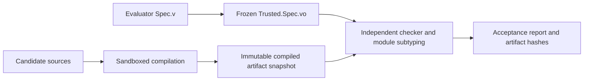

# Checking AI-generated programs and proofs

An evaluator writes a normal `Spec.v` containing a module type named `SOLUTION`.
The AI submits `Candidate.v`, exporting a module named `Implementation`. The
acceptance gate independently checks the compiled libraries and asks Rocq's
kernel whether the submitted module satisfies the frozen signature.

The candidate controls its program, proof scripts, helper source files, notation,
and compiler diagnostics. It does not control the specification, axiom policy,
toolchain, build commands, kernel gate, or namespace mappings used for acceptance.

The default backend is **Wasmtime + WASI**, with **Rocq 9.3.0 on Linux**, **Rocq Stdlib 9.2.0** and
**stdpp 1.13.0**, pinned in [coqcp-toolchain.opam](../coqcp-toolchain.opam).
The internal module-checking API is
version-specific; another version requires an explicit port and regression run.
There is no silent fallback to another version or to unsandboxed compilation.
Bubblewrap remains an explicitly selectable native backend (`--backend bubblewrap`).
For the runtime's build stages, cache layout, taint rules, and debugging workflow,
see the [WASI maintainer guide](WasiRuntime.md) and
[technical decision record](WasiDecisions.md).

## Installation

Install the pinned opam toolchain in `/opt/rocq/9.3.0`:

```sh
sudo apt-get update
sudo apt-get install ca-certificates curl git python3 build-essential ocaml opam libgmp-dev pkg-config m4 rsync unzip util-linux
sudo install -d -o "$(id -un)" -g "$(id -gn)" /opt/rocq
bash tools/install-toolchain.sh
bash tools/install-wasi.sh
export PATH=/opt/rocq/9.3.0/bin:$PATH
rocq --version
rocq makefile -f _CoqProject -o Makefile
make clean
make -j2
python3 tools/adversarial/check.py build
```

`install-wasi.sh` uses Docker to build and export a standalone Wasmtime host.
Docker is needed only for this build; checking runs directly on the host without
containers, privileged flags, user namespaces, mount namespaces, or bubblewrap.
CI caches that exported host separately from the proof toolchain and proof results.
The shipped host build targets Linux x86-64 with an Ubuntu 24.04 ABI.
WASI SDK 34 and OCaml 5.4.0 sources are checksum-pinned. The build compiles
OCaml's C runtime and Rocq's unchanged C VM to WASM, then embeds evaluator-owned
OCaml bytecode in three executables. OCaml's `-compat-32` checks bytecode portability;
no native proof artifact is truncated to fit the target.

Both the compiler and independent acceptance checker enable Rocq's VM. The trust
base therefore includes the kernel and VM, as requested. Native machine-code
conversion, dynamic native plugins, subprocesses and asynchronous proofs remain
unavailable. Approved tactic plugins are statically linked. Each invocation uses
a fresh single-domain OCaml runtime and guest memory; parallel compilation uses
separate invocations. The original OCaml tracing GC and Marshal implementation
operate inside WASM linear memory.

The evaluator's runtime modules are compiled ahead of time and cached. Only those
trusted runtime modules enter Wasmtime's executable-code deserializer; submitted
`.vo` files are proof data. Their contents cannot supply WASM or native plugins.
The Docker host uses the pinned stock Wasmtime 49.0.0 Python package and
PyInstaller. Wasm GC and multiple memories are disabled; OCaml collects Rocq's
objects in the shared C/libc linear memory. No custom Rust build is required.
Trusted Rocq, Stdlib, stdpp and project sources are rebuilt for the same WASI
runtime and cached in `.verification/wasi-libraries`. The initial build provisions
the project's dependency closure; additional approved installed libraries are
provisioned when the sandboxed dependency scanner requests them. Library identity
binds the complete trusted source set, so provisioning another unchanged library
does not change a frozen contract. Native 64-bit `.vo` files
are incompatible with its 31-bit OCaml serialization and are never silently
converted. Libraries requiring plugins outside the approved static set are excluded.

For the optional native backend, install `bubblewrap` and `libseccomp-dev`, and
pass `--backend bubblewrap` consistently to `build`, `prepare`, and `check`.
Use a regular, non-root OS user with this backend. Root
bypasses Linux's process-count resource limit, so the runner rejects root.
Installation can use `sudo`. No privileges are requested by the checker.

The native backend's Bubblewrap must support user, mount, PID, IPC, and UTS namespaces, and seccomp
must be available. The default `--network-isolation auto` mode first probes a
separate network namespace. If an enclosing sandbox denies only that namespace,
the runner probes and selects the secure seccomp mode, which retains the
enclosing network namespace but installs a filter through Bubblewrap before the
worker starts. The filter denies socket creation and network operations in the
worker and every child. Compiler and kernel processes also retain their existing
seccomp restrictions. If neither complete mode can be constructed, the job
reports `No safe condition for sandbox` and rejects before reading submission
code. There is no unsandboxed fallback. An evaluator can require one mode with
`--network-isolation namespace` or `--network-isolation seccomp`. The checker
never disables host protections. This profile expects system tools under `/usr`
and the dedicated Rocq toolchain under
`/opt/rocq/9.3.0`, rather than a snap, an opam switch in a home directory,
macOS, or Windows. Only installed runtime directories from that switch are
mounted; opam state, downloads, and build logs are excluded.

Upgrading the toolchain invalidates existing frozen bundles. Rebuild the project
and the gate, prepare each specification again, and record the new evaluator ID.

## Write the specification

The small [Increment specification](../verification/increment/spec/Spec.v) is:

```coq
From CoqCP Require Import Options.

Definition required (program : nat -> nat) : Prop :=
  forall input, program input = S input.

Module Type SOLUTION.
  Parameter program : nat -> nat.
  Parameter correct : required program.
End SOLUTION.
```

`program` and `correct` are mandatory signature fields. Additional fields are
supported by Rocq's ordinary module subtyping. The signature itself and the
submitted implementation must not be unapplied functors. Helper functors are
allowed and their stored bodies are audited.

`Parameter` inside a module type expresses an interface requirement. It does not
add a global axiom when a concrete implementation supplies that field. In
contrast, an implementation that simply declares its program or admits its proof
introduces assumptions, which the policy rejects by default.

For competitive programs, specify successful execution and the complete output
stream. A statement that only constrains output _if execution succeeds_ can let
an always-failing program satisfy the requirement. Keep input bounds and memory
semantics on the trusted side too. For interactive programs, require the exact
flush snapshots as well.
[the Permuted Binary Strings specification](../verification/permuted-binary-strings/spec/Spec.v)
binds the program to the generated entry point and requires successful full
execution with all query/reply boundaries; see
[End-to-end verification](EndToEndVerification.md).

## Freeze the evaluator's specification

```sh
python3 tools/adversarial/check.py prepare \
  --spec verification/increment/spec/Spec.v \
  --bundle .verification/increment-bundle
```

Preparation snapshots the project's registered compiled libraries, renames the
specification to `Trusted.Spec`, compiles it in the sandbox, and independently
checks its dependency closure. The bundle contains:

- `spec/Spec.v` and `spec/Spec.vo`;
- the compiled project libraries under their existing logical namespaces;
- `manifest.json`, containing SHA-256 file hashes, the toolchain fingerprint,
  exported interface identities, the axiom policy, and the baseline audit.

The WASI backend rebuilds registered trusted library sources into its separate
portable library cache before preparation. The optional native backend expects
the project libraries to be built first and snapshots their evaluator-controlled
`.vo` files; it does not certify their correspondence to source text.

The command prints JSON with a `spec_id`. **Record that ID in evaluator-controlled
storage.** It is the SHA-256 hash of the manifest. The checking command requires
that original ID; accepting an ID supplied by the candidate would let the
candidate substitute a different bundle and recompute its hashes.

By default, the allowed axiom set is empty (`--axiom-policy none`). An evaluator
can instead select the exact set already trusted by project CI:

```sh
python3 tools/adversarial/check.py prepare \
  --spec verification/knapsack/spec/Spec.v \
  --bundle .verification/knapsack-bundle \
  --axiom-policy ci \
  --cpu-seconds 600 --wall-seconds 1200 --memory-mib 4096 \
  --fuel 2000000000000
```

The shared policy is [trusted_axioms.json](../verification/trusted_axioms.json).
Its only current entry is
`Stdlib.Logic.FunctionalExtensionality.functional_extensionality_dep`.
Both the project `rocq check` CI job and the submission checker reject every axiom
outside this set. There is no option to supply an arbitrary name or regex.
The kernel gate embeds the same fixed set at build time and also rejects
unapproved names when invoked directly. Names refer to declarations in the
frozen specification and fingerprinted system libraries.

Policy changes require a reviewed change to the trusted CI infrastructure,
rebuilding the gate, and freezing new specification bundles. Evaluators must
use their approved infrastructure revision; a candidate's policy file is not
an authority. Allowed axioms remain logical assumptions, not proof obligations
that the tool discharges. Reports list the axioms actually encountered, which
may be a subset of the selected policy.

Rocq 9.3 also reports inductives that rely on its default treatment of indices
when generating universe constraints. The shared policy records the six existing
declarations reported by project CI: `eq_true`, `eq`, `if_spec`, `eq_dep`, `null`,
and `TCEq`, each under its fully qualified trusted library name. The kernel gate
embeds this set too and rejects further declarations with that property.
This records the behaviour of the pinned standard libraries, including ordinary
equality. The `none` policy excludes axioms while retaining these base theory
declarations. Changing this set also requires rebuilding and freezing new bundles.

## Submit a program and proof

A submission is a dedicated directory containing only top-level `.v` files,
including `Candidate.v`. Names must be ASCII Rocq identifiers. Symlinks, special
files, subdirectories, precompiled libraries, project files, and build scripts
are rejected. At most 128 sources and 8 MiB of source text are accepted. The
source-count bound accommodates the complete Koxia proof chain (74 files);
the byte, artifact, memory, CPU, and filesystem limits remain enforced.

For the increment contract, `Candidate.v` can contain:

```coq
From CoqCP Require Import Options.
Require Trusted.Spec.

Module Implementation.
  Definition program : nat -> nat := S.
  Lemma correct : Trusted.Spec.required program.
  Proof. intro input. reflexivity. Qed.
End Implementation.
```

Helper files are compiled under `Submission`, and can be required with names
such as `Submission.Helper`. The build worker uses `rocq dep` to order the submitted
sources and invokes `rocq compile` directly. It never invokes a submitted Makefile,
`_CoqProject`, shell command, or package-install script.

With WASI, each source runs in a fresh Wasm store, heap, descriptor table and
private writable filesystem. Earlier compiler artifacts are read-only inputs.
Only immutable runtime code and input bytes are shared across invocations.
Each compiler writes its `.vo` into a fresh unpredictable directory. After that
compiler exits successfully, the trusted worker captures the bounded regular
file and publishes it under the expected library name for later dependencies.
Additional `.vo` outputs are rejected, and earlier outputs cannot be modified.
Captured bytes are kept in coordinator memory, so a later source
cannot replace an earlier compiler result that will be sent to the kernel gate.

The AI can develop against a copy of the specification. The evaluator must keep
its bundle and recorded ID outside the AI's writable submission environment.

## Check a submission

Use the specification ID printed during preparation:

```sh
python3 tools/adversarial/check.py check \
  --bundle .verification/increment-bundle \
  --spec-id YOUR_RECORDED_SPEC_ID \
  --submission verification/increment/candidate \
  --output .verification/increment-result
```

Bundle and result directories must be new when they are created. Choose fresh
names for subsequent runs; the tool refuses to overwrite previous artifacts.

The checking command prints a JSON report and exits zero only for acceptance.
Once a result directory is created, it stores `report.json`, the submitted source
snapshot, and any compiled `.vo` artifacts. Admission failures such as an invalid
bundle ID print rejection JSON without creating a result directory. Reports
include the specification ID, source and artifact hashes, toolchain fingerprint,
resource limits, actual axioms, and the stage at which a failure occurred.

The certificate concerns the **compiled module artifacts identified by those
hashes**. Compiler logs and pretty-printed statements are never evidence of
acceptance. Source hashes provide provenance; they are not a separate proof that
an arbitrary compiler or plugin faithfully translated the source text.

## How the gate avoids notation deception



The kernel gate is [spec_check.ml](../tools/adversarial/spec_check.ml). It links
`rocq-runtime.checklib`, the same compiled-library loader and checker used by
`rocq check`, plus Rocq's module subtyping implementation. It does not link the
vernacular interpreter or load candidate ML plugins.

In a fresh process, the gate:

1. Registers only evaluator-controlled logical load paths.
2. Calls `Check.recheck_library` on `Trusted.Spec`, `Submission.Candidate`, and
   **every submitted helper library**, with empty `admit` and `norec` lists.
3. Rechecks opaque proof bodies, or reuses a matching independently checked WASI prefix certificate. VM conversion stays enabled and VM bytecode is regenerated from declarations; native conversion remains disabled.
4. Audits global declarations and stored module/functor bodies for unapproved
   axioms, disabled guard/positivity/universe/elimination checks, inductives
   outside the CI set for indices not mattering, impredicative Set,
   definitional UIP, and rewrite rules. Signature parameters are distinguished
   from implementation assumptions; sealed module bodies are examined too.
5. Constructs the canonical module paths `Trusted.Spec.SOLUTION` and
   `Submission.Candidate.Implementation` directly, without looking them up in
   candidate short-name or notation tables.
6. Calls `Subtyping.check_subtypes` with Rocq's checked universe conversion.

The supervisor accepts only strict JSON from the compiler worker and kernel
checker. Duplicate fields, non-standard JSON values, missing or extra fields,
the wrong Rocq version, and axioms outside the frozen policy all fail closed.

The comparison uses kernel conversion and ordinary module subtyping. It does not
compare strings, pretty-printed syntax, proof names, or an AI's explanation.
Extra implementation fields are allowed. Missing fields, a proof about another
program, and an extra unprovided premise fail the required field checks.

For example, a submission may introduce:

```coq
Notation "'required' p" := True (at level 10).
```

It can then prove its fake requirement, but the gate still compares against the
original compiled signature. The regression suite demonstrates rejection of this
case and of namespace shadowing.

## Sandbox and resource boundaries

[wasi_host.py](../tools/adversarial/wasi_host.py) embeds Wasmtime and implements
an allowlist of WASI preview1 imports. [wasi_fs.py](../tools/adversarial/wasi_fs.py)
implements guest filesystem operations entirely in memory. Guest paths and
descriptors never reach host filesystem APIs. No network, process-launch,
symlink, or arbitrary host-function imports are linked. The environment contains
only fixed runtime settings, and standard input is empty.

The coordinator grants read-only source/library/artifact nodes and bounded
writable `/work` and `/tmp` nodes. Directory traversal is checked against each
directory capability. Renames retain node authority, and unlinked open files
continue counting toward quotas. File count, descriptor count, individual file
size, total workspace size, diagnostics, and retained artifact bytes are bounded.
Fresh stores prevent a previous source from modifying later compiler globals,
heap objects, descriptors, or temporary files.
Micromega's cache-file locks are no-ops inside this single-threaded private
filesystem; solver cache files remain local to that invocation.

Fuel bounds Wasm execution. The coordinator's wall timer kills the host process
group on timeout; OS CPU and address-space limits also cover native host work,
GC, runtime code, and input/output transport. Limits are enforced without namespace
creation. The runtime and its WASI bindings remain trusted code and still use the
OS kernel; Wasm removes arbitrary guest syscall access, not every kernel dependency.

For the optional native backend, [check.py](../tools/adversarial/check.py) supervises Bubblewrap processes.
[worker.py](../tools/adversarial/worker.py) is an evaluator-controlled build
worker. [sandbox_exec.c](../tools/adversarial/sandbox_exec.c) applies resource
limits and a libseccomp filter before executing each parser, compiler, or kernel
gate process.

Native compilation and independent checking run with:

- separate user, PID, mount, IPC, and UTS namespaces;
- a separate network namespace by default, or an inherited network-syscall
  filter installed before the worker starts in explicit seccomp mode;
- all capabilities dropped, no new privileges, and further user namespaces
  disabled;
- a cleared environment, isolated temporary home, and no Rocq startup script;
- read-only system runtime directories, narrowly selected OCamlfind
  configuration, specification bundles, tool binaries, and source/artifact inputs;
- no host home directory, repository mount, credentials, or host network;
- read-only root and private `/dev` filesystems, a bounded writable `/work`
  tmpfs, and a 16 MiB `/tmp` tmpfs;
- denied process forks, sockets, namespace changes, mounts, tracing,
  cross-process memory access, signaling of the build supervisor, and privileged
  kernel APIs; anonymous memory-backed files and IPC objects are also denied so
  they cannot bypass the tmpfs quotas; OCaml runtime threads are allowed;
- a build supervisor protected against child access through `/proc` by disabling
  dumpability.

The worker sends artifact bytes back to the coordinator. It does not bind a
writable host directory into the sandbox. Unexpected file names, symlink outputs,
oversized artifacts, and malformed artifact messages are rejected. After the
compiler exits, a separate checker sandbox receives the artifacts read-only.

Default limits are:

| Resource                                              |     Default | CLI option           |
| ----------------------------------------------------- | ----------: | -------------------- |
| Wall time per compilation or checking stage           | 120 seconds | `--wall-seconds`     |
| CPU time per WASI invocation / native process          |  60 seconds | `--cpu-seconds`      |
| Wasm instruction fuel per WASI invocation              |  50 billion | `--fuel`             |
| Virtual address space per process                     |    2048 MiB | `--memory-mib`       |
| Writable virtual workspace / native work tmpfs        |     256 MiB | `--work-mib`         |
| Individual output file and total retained `.vo` bytes |      64 MiB | `--artifact-mib`     |
| Compiler diagnostics / checker output                 |       1 MiB | `--log-mib`          |
| Open file descriptors per tool process                |         128 | fixed                |
| Tasks for native tools under the evaluator's OS user  |         256 | fixed `RLIMIT_NPROC` |

For WASI, CPU time is reset per invocation against cumulative host CPU usage.
Memory bounds cover the whole host process, including its shared immutable
snapshots and runtime code. Runtime AOT compilation happens during the trusted
build step, before guest execution limits apply. The native backend's
CPU and memory limits are per process, not a cgroup-wide accounting promise.
Submitted source batches compile sequentially. WASI grants no process creation.
For the native backend, `RLIMIT_NPROC` is shared with other jobs running under
the same host user, so a dedicated evaluator user avoids interference. The outer
wall timer kills the host process group; native PID namespaces also remove descendants.
A resource-limit rejection means the attempt was not certified, not that its
mathematical statement is false.

For a public service, add admission rate limits, bounded job concurrency,
artifact retention limits, and worker lifecycle management outside this runner.
Run workers on patched, disposable machines and keep the evaluator's OS,
toolchain, driver, and expected specification IDs trusted. This sandbox reduces
the submission's access; it does not establish correctness of the Linux kernel
or eliminate vulnerabilities in the trusted checker.

## Structural sharing and caching

The WASI host reuses its engine, compiled evaluator modules, and immutable input
bytes during a compilation batch. Guest stores and writable files are never reused.
This minimizes cross-module taint while avoiding repeated Wasmtime engine and
module setup. OCaml initialization still runs in each fresh guest; parsed Rocq
heaps are not shared across stores.
Each submission module sees its own source and the helper sources and artifacts
in its declared `Require`/`Load` dependency closure. Unrelated helpers are compiled
separately and all their artifacts still pass the kernel gate.
The trusted library build schedules independent modules concurrently (two workers
by default; `COQCP_WASI_BUILD_JOBS` selects one to four). Each receives only the
compiled artifacts in its dependency closure, making the visible inputs independent
of scheduling order.
Concurrent coordinators serialize shared runtime and trusted library builds;
cache entries and compiled library files are replaced atomically.

The C runtime uses OCaml's original Marshal identity tracking and tracing GC.
Equal but distinct objects stay distinct, and cycles and physical sharing survive
serialization. The translation-specific serializer replacement from the earlier
prototype has been retired. Serialization still runs within each invocation's
fuel, CPU, memory and wall-time bounds.

The default evaluator-owned cache is `.verification/wasi-cache`; use `--cache`
to choose another trusted directory or `--no-cache` to compile specifications and
candidates and run kernel checks without result caching. Built runtimes and the
trusted library installation remain available with `--no-cache`.
Keep this cache outside a candidate's writable environment, just like the frozen
bundle and toolchain. CI restores it only within the matching infrastructure key.

A compilation entry binds source bytes, namespace, flags, limits, and compiler
identity. It binds libraries and the specification through every consulted
input path, including file contents actually read, metadata queried, missing-file
lookups, and directory listings. Metadata observations bind type and size; the
virtual filesystem supplies fixed timestamps and inode values.
Reuse requires those observations to match. Thus a changed helper artifact
invalidates dependents, a newly available optional module invalidates a previous
negative lookup, and unobserved unrelated changes do not invalidate an unchanged
subtree. Dependency artifact hashes propagate changes transitively.

Only successful compilations are cached. Kernel results use a separate cache
domain binding the complete frozen contract, every submitted artifact (including
unused helpers), toolchain, policy arguments, and limits. Responses are validated
before entering that cache and again on use. Cache files include artifact hashes;
malformed, truncated or hash-mismatched entries cause a miss. Reports expose hit
and miss counts. Deleting caches affects performance, not acceptance policy.
The trusted library manifest also verifies every materialized `.vo` hash before
reuse; missing or damaged outputs are restored from verified compilation entries.

## Shipped contracts and checks

Every problem uses `verification/<problem>/spec/Spec.v` and
`verification/<problem>/candidate/`. There is one small specification per
problem; proof helpers are submitted with the candidate. Candidates may import
general `CoqCP` theories. Concrete program proofs are excluded from the frozen
project libraries. See [the layout and commands](../verification/README.md).

| Problem                 | Contract                                                                      |
| ----------------------- | ----------------------------------------------------------------------------- |
| Increment               | Total successor function                                                      |
| Watermelon              | Existence of a division into positive even weights                            |
| Restore Three Numbers   | Reconstruction up to permutation                                              |
| Knapsack                | Successful generated execution and exact decimal encoding of an optimal value |
| Disjoint Set Union      | Generated union refines the abstract model; merge-score bound and attainment  |
| K-th Highest Score      | Successful generated search-loop refinement with truthful oracle queries      |
| Permuted Binary Strings | Complete generated execution, exact bytes, and every flush boundary           |
| Koxia and Bracket       | Complete generated execution and positional-mask optimum count                |

The first three contracts use no axioms. The generated execution contracts use
the CI policy. Each spec defines its own formal scope and input bounds.

Run the acceptance and containment regression suite:

```sh
python3 -m unittest discover -s tools/adversarial/tests -v
```

Example configuration is declarative data in
[`adversarial-examples.json`](../verification/adversarial-examples.json), with an
independent [JSON Schema](../verification/adversarial-examples.schema.json).
It selects each specification, candidate directory, axiom policy, and named
resource profile. Each profile explicitly contains every checker resource limit;
changing a checker default cannot silently change an example's budget.
`examples.py` remains the orchestration entry point and reads these values.

The runner validates configuration before provisioning or creating results.
Its standard-library validator supports the schema keywords used here, rejects
unsupported keywords, and resolves only local references. A full JSON Schema
validator can consume the same files. Additional checks reject duplicate names,
unknown profiles, missing paths, and paths resolving outside the repository.
CI watches and includes both documents in proof-cache lookup keys. Internal
cache validation still binds actual source bytes, selected limits, and frozen
axiom policy; an unused registry entry does not change a proof's semantics.

Run all shipped contracts and retain their bundles, reports, and artifacts:

```sh
python3 tools/adversarial/examples.py --output .verification/example-results
```

The suite covers valid and alternate programs, helper dependency ordering,
notation and namespace deception, extra premises, missing fields, abstract and
functor implementations, the shared CI axiom policy, arbitrary policy rejection,
admitted and unused axioms, weaker decoder and unobserved execution certificates,
unsafe definitions inside unused functors, corrupted libraries, bundle and
manifest tampering, symlinks, precompiled submissions, attempted `.vo` creation
or replacement, and sandbox filesystem, network, fork, timeout, CPU, memory,
output, and disk limits. Missing WASI host support fails closed. Native sandbox
tests, including its root restriction, run with `COQCP_TEST_BUBBLEWRAP=1`.

[The CI workflow](../.github/workflows/adversarial.yml) builds trusted project
libraries, runs the regressions, checks the examples, and uploads the resulting
bundles and certificates. Docker builds and exports the standalone host on a
cache miss. Proof checking runs directly on the runner using WASI capabilities;
it needs no container or namespace privileges. These CI regressions check the
infrastructure in the proposed commit. A
production evaluator must use its own approved revision, rather than running
the submitting AI's proposed checker, workflow, or specification modifications.

## What a certificate does and does not establish

The gate establishes that the checked compiled module satisfies the frozen
formal specification under its recorded logical assumptions. Specification
review remains necessary, especially when an AI also writes `Spec.v`: an
incorrect model, impossible precondition, or incomplete contract can be proved.

The input/output example checks the repository's Coq execution model. It does
not certify the corresponding generated C++, the TypeScript code generator,
allocation behavior of the host runtime, or a separately supplied executable.
Connecting a certificate to a native executable requires a verified compiler,
checked translation certificates, or an explicitly trusted translation and
build chain that records the relationship to the accepted artifact hashes.

Useful upstream references:

- [Rocq module signatures and subtyping](https://rocq-prover.org/doc/V9.3.0/refman/language/core/modules.html)
- [Compiled-library checker](https://rocq-prover.org/doc/V9.3.0/refman/practical-tools/coq-commands.html#compiled-libraries-checker-rocqchk)
- [Rocq 9.3.0 checker loader](https://github.com/rocq-prover/rocq/blob/V9.3.0/checker/checkLibrary.ml)
- [Rocq 9.3.0 module subtyping interface](https://github.com/rocq-prover/rocq/blob/V9.3.0/kernel/subtyping.mli)
- [Rocq 9.3.0 release](https://github.com/rocq-prover/rocq/releases/tag/V9.3.0)
- [Stdlib 9.2.0 release](https://github.com/rocq-prover/stdlib/releases/tag/V9.2.0)
- [stdpp releases](https://gitlab.mpi-sws.org/iris/stdpp/-/tags)
- [Bubblewrap documentation](https://github.com/containers/bubblewrap)
- [libseccomp](https://github.com/seccomp/libseccomp)

WASI kernel checking can reuse independently checked library-prefix
certificates, including their indirect opaque-proof taint and hidden-axiom
dependency maps. It reconstructs VM code and repeats the final contract and
axiom audits. Cold runs can checkpoint completed libraries and resume in fresh
instances under one wall deadline; a checkpoint is never acceptance. See
[WasiDecisions.md](WasiDecisions.md) for the cache trust and invalidation rules.
