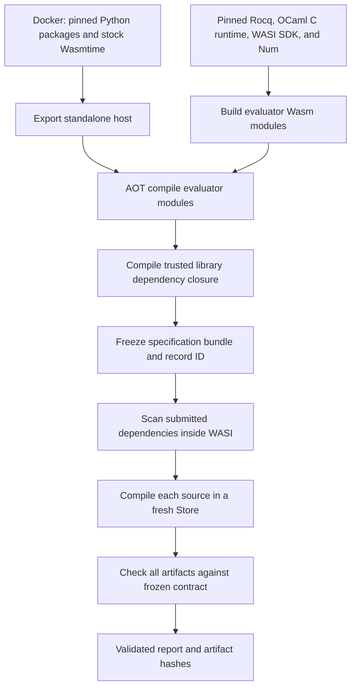

# Maintaining the WASI proof checker

The [checker guide](AdversarialChecking.md) describes contracts and acceptance.
This guide explains the runtime implementation and its operational costs.
The [implementation decision record](WasiDecisions.md) records the technical
choices, rationale, tradeoffs, and rejected performance experiments.
The default backend runs both the source compiler and the independent kernel
checker in Wasmtime. Docker builds the standalone host; it does not execute
submissions. Bubblewrap is an optional backend selected explicitly.

## Build and execution stages



1. `tools/build-wasi-host.sh` runs the Docker build and exports its `/host`
   directory to `.verification/wasi-host/host`. The executable and its adjacent
   `_internal` directory form one artifact; keep them together. The current
   build targets Linux x86-64 and the Ubuntu 24.04 ABI.
2. `tools/install-wasi.sh` installs WASI SDK 34 and Num 1.6.
   Use `--no-host` when installing a previously exported host, as CI does.
   The host lives at `/opt/rocq/wasi/host`.
3. `check.py build` builds three evaluator-owned modules: `compile-safe`,
   `rocq-dep`, and `spec-check`. Each has a `.wasm` source and a `.cwasm` AOT
   image. AOT compilation is trusted provisioning work and can use substantially
   more memory than proof execution.
4. Trusted libraries are rebuilt from source for the portable runtime. The
   initial selection is the project dependency closure and the boot libraries.
   The WASI dependency scanner can request additional approved installed
   libraries later. Provisioning an unchanged library preserves frozen bundle
   identity because identity binds the complete trusted source set.
   The guest scanner registers installed source roots explicitly and includes
   core dependencies, allowing it to identify libraries before their portable
   `.vo` files exist. It omits native plugin dependency lookup because plugins
   are already statically linked and remain subject to compiler policy.
5. Preparation and checking use bounded guest invocations. Only evaluator-owned
   runtime images enter Wasmtime's executable-code deserializer. Submitted `.vo`
   files are data for Rocq's library loader and independent checker.

The workflow in [adversarial.yml](../.github/workflows/adversarial.yml) has separate
host, toolchain, and proof caches. A host cache hit skips Docker entirely. A
source change can restore the previous proof cache through a prefix match.
A final same-platform fallback can recover reusable compilation after checker or
scanner changes; individual entries must still pass their own fingerprint and
observation checks, and stale runtime images are rebuilt.
GitHub Actions cache keys improve reuse; they are not the acceptance policy.
Regressions and complete examples run in dependent jobs, each with its own
six-hour deadline. The shared
[`setup-wasi` action](../.github/actions/setup-wasi/action.yml) restores the host,
toolchain and proof caches for both jobs. The example job first looks for the
regression job's snapshot from the same workflow run; each job saves completed
work under a distinct immutable key, including after a later proof fails.

## Where state can be shared

One host process reuses an Engine, compiled evaluator Modules, and interned
immutable byte strings. Every compiler invocation gets a fresh Store, instance,
heap, globals, descriptors, `/work`, and `/tmp`. Rocq's parsed environments are
not shared. Compiled dependencies cross this boundary as read-only artifact
bytes. Micromega's temporary solver caches are private to an invocation, so its
file-lock primitive requires no OS lock.

Each compilation batch reuses a base snapshot containing the shared toolchain
and frozen bundle. Only that module's source closure and compiled dependencies
travel as an overlay. The host copies the base mapping before applying an
overlay; the stored base never acquires previous sources or artifacts. Trusted
library workers use the same scheme with metadata as their shared base. Cache
observations bind the combined visible filesystem, including overlay contents.

Candidate modules compile in dependency order. Each sees only its source and
the helper sources/artifacts in its declared `Require`/`Load` closure. Unrelated
helpers still compile and undergo the final audit. Trusted library workers use
the same closure rule, allowing independent sources to compile concurrently
without changing their visible inputs. `COQCP_WASI_BUILD_JOBS` selects one to
four workers; the default is two. More workers also mean more host memory.
Corelib dependencies are scanned separately so short foundation imports do not
resolve through similarly named Stdlib/stdpp wrappers. The trusted manifest
records dependency edges as well as source and artifact hashes; a changed graph
forces entry-level observation checks rather than relying on old file hashes.

## Cache identities and taint

| Location                                   | Contents                                                            | Reuse requirements                                                                                                 |
| ------------------------------------------ | ------------------------------------------------------------------- | ------------------------------------------------------------------------------------------------------------------ |
| `.verification/wasi-host`                  | Docker-exported executable and dependencies                         | Host source, dependency pins, platform key                                                                         |
| `/opt/rocq`                                | Pinned native build tools, WASI SDK, OCaml C runtime source and Num | Toolchain and installer key                                                                                        |
| `.verification/wasi`                       | Evaluator Wasm and AOT images                                       | Runtime source, policy, and actual packaged-host fingerprints                                                      |
| `.verification/wasi-libraries`             | Materialized portable trusted `.vo` files and manifest              | Source/compiler identity, dependency graph and every artifact hash                                                 |
| `.verification/wasi-cache/trusted-compile` | Successful trusted library compilations                             | Compiler, source, limits, observed inputs                                                                          |
| `.verification/wasi-cache/compile`         | Successful specification/candidate compilations                     | Compiler, source, namespace, flags, limits, observed inputs                                                        |
| `.verification/wasi-cache/kernel`          | Validated checker responses                                         | Full runtime, contract, arguments, limits, and all visible artifacts                                               |
| `.verification/wasi-cache/checked-prefix`  | Independently checked library prefixes and hidden-axiom maps        | Checker/host/profile seed, complete preceding environment, current artifact bytes, and indirect opaque-proof reads |

Compilation entries record a map of input observations, rather than just a list
of imported module names:

- Reading a file binds its content hash.
- Querying file metadata binds its type and size. The virtual filesystem fixes
  timestamps and inode fields, so those cannot carry hidden changing state.
- Looking up a missing path records its absence.
- Listing a directory binds its child names and types.

On reuse, every recorded observation must match the new invocation's inputs.
Changing `Helper.vo` invalidates a dependent that read it. Recompiling that
dependent changes the artifact hash seen by its own dependents. Adding a file
invalidates a negative lookup or affected directory listing. An unrelated
unobserved change can retain a cache hit. A source's changed dependency commands
change its source hash, and the sandboxed dependency scan runs before selecting
the visible closure.

This tracks taint through artifacts and filesystem observations while fresh
Stores prevent writable runtime state from becoming an additional taint source.

Independent checking also reuses certified library prefixes. Each prefix binds
all earlier checked libraries, its complete artifact bytes, and the actual
opaque-proof tables read during checking. Its serialized dependency map
preserves hidden axioms in sealed modules. A hit reconstructs declarations and
regenerates VM code in a fresh Store; the final axiom and contract audits still
run. The upstream `unsafe_import` function performs this reconstruction only
for a matching independently checked certificate, never merely for a compiled
library. Certificate storage is evaluator-owned trusted infrastructure.

Cold kernel runs can return `prefix-checked` checkpoints after completed
libraries. The coordinator saves these certificates and resumes in a fresh
instance under the same overall wall deadline. CPU, fuel, memory and output
bounds apply to each invocation; restart overhead counts toward wall time.
Checkpoints cannot accept a submission. Large individual libraries still have
to finish within an invocation's bounds. `--no-cache` performs one complete
fresh independent check without prefixes or checkpointing.

The complete-example runner can retry a bounded compilation or kernel
operation after a resource rejection that saved new completed modules or
checked-prefix certificates, respectively. The independent manifest's
`operation_attempts` controls the cap (currently three). Logical rejections,
operations without completed progress, and `--no-cache` runs are never retried
this way. Every attempt uses the same limits. Earlier failed reports and
artifacts remain in `attempt-N`; `result` holds the final attempt, and stdout
records the attempt count. Only a complete independent kernel and contract
audit can report acceptance. A retry reconstructs its module environments in
fresh Stores and revalidates the normal taint-aware cache observations.

There is no shared mutable guest session whose previous modules need to be
folded into every cache key. Kernel caching is deliberately broader: even unused
helper artifacts must be bound because all helpers are audited.

Trusted compilation uses the actual compiler and host identity, so rebuilding
only the dependency scanner or checker does not force every library to compile
again. A recorded matching compiler identity can bridge older cache domains;
source, limits and observations must still match.
When changing trusted compiler arguments, environment or visibility semantics,
bump `compile_protocol` in `wasi_libraries.py`. Its explicit version is part of
the trusted compiler identity. Source-proof adaptations are hashed directly.

Kernel reuse has separate prefix and complete-result domains. A new contract
or candidate can reuse independently checked imports, but cannot reuse final
acceptance without matching the full runtime, contract, limits and artifact
set. Cold certification can still take minutes with arithmetic and stdpp
libraries; compilation cache hits alone do not certify those imports.

Only successful compilation results enter the cache. Cache entries are written
atomically and include payload hashes; damaged entries become misses. Materialized
trusted libraries are also hash-checked and repaired from valid entries when
possible. A successful trusted build under earlier stricter provisioning limits
can be reused under increased limits; candidate compilation requires matching
limits. Checker responses are validated before caching and again before use.

All these directories are evaluator-owned infrastructure. Payload hashes detect
damage; they do not authenticate a cache writable by a candidate. Keep caches,
toolchains, frozen bundles, and recorded specification IDs outside candidate
write access. `--cache PATH` chooses a cache directory; `--no-cache` disables
specification/candidate compilation and checker-result caching. It does not
uninstall built runtimes or the trusted library installation.

## Why the portable runtime needs patches

The build deliberately pins these changes in reviewable source:

- **Existing C VM:** `wasi_c_runtime.py` compiles Rocq's original C evaluator
  together with OCaml 5.4.0's C runtime. Both share the same OCaml object layout
  in WASM linear memory. The compiler and independent checker enable VM conversion;
  native machine-code conversion remains disabled. The checker also sets upstream
  `CheckFlags.enable_vm`, which discards stored VM metadata and recompiles bytecode
  from declarations before checking them. Candidate-supplied VM bytecode is not
  trusted. This avoids a new evaluator
  implementation and the slow `vm_compute` fallback of the earlier translated port.
  OCaml's separate bytecode interpreter runs Rocq's compiler, tactics and kernel;
  enabling the Gallina VM does not remove that general interpretation cost.
- **Checker allocation and audit:** the checker uses a two-million-word nursery
  (8 MiB on WASM32) and 200-percent GC space overhead. Large imported environments
  remain live while temporary typechecking objects die. Hidden functor declarations
  query the original opaque-dependency table through a singleton environment;
  global dependencies have already been collected, so they are not scanned again
  for every hidden declaration. All proof bodies, typing flags and assumptions
  still undergo the same independent checks.
- **31-bit representation:** WASM32 uses 32-bit pointers and 31-bit OCaml integers.
  Rocq selects its original `uint63_31` and `float64_31` implementations,
  including its original C float primitives. No translated float wrappers remain. Build-host
  bytecode passes `-compat-32`. Three unsigned hash-mask literals are constructed
  with `Int32.to_int Int32.max_int` at runtime, preserving their target bit pattern.
  Trusted `.vo` files are rebuilt from source; there is no integer truncation.
- **Bytecode embedding:** each runtime contains its complete evaluator-owned
  bytecode and ordered primitive table. Existing module hashes therefore cover
  every executable byte and remain part of compiler and kernel cache identity.
  Symbol/CRC metadata is re-marshaled with an explicit 32-bit compatibility check
  during trusted provisioning. Candidate artifacts never enter that native helper.
- **Original serialization and GC:** OCaml's existing Marshal identity tracking
  and tracing collector handle sharing and cycles inside linear memory. The earlier
  translation-specific Marshal and Wasmtime collector patches have been retired.
  The Docker build uses the stock pinned Wasmtime wheel; Wasm GC and multi-memory
  are disabled. C runtime/libc share one linear memory.
- **Exceptions:** WASI SDK's setjmp/longjmp support uses WASM exception handling,
  `-wasm-enable-sjlj`, `-wasm-use-legacy-eh=false` and `-lsetjmp`. OCaml exceptions
  retain their original C runtime implementation.
- **Single domain:** the reviewed [OCaml patch](../tools/adversarial/portable/ocaml-wasi.patch)
  forces one domain in parameter parsing and domain initialization. Thread creation
  is unavailable. SDK single-thread mutexes use `PTHREAD_MUTEX_NORMAL`; its error
  checking mutex implementation expects a thread descriptor unavailable here.
  Concurrency comes from separate fresh Stores, never shared guest heaps.
- **Memory mapping:** SDK mmap emulation allocates only guest linear memory.
  Reserved regions are allocated read/write, commit clears their bytes, and
  decommit retains allocation until unmap/Store destruction. There is no guest
  access to host mmap or page protection. This can retain more memory than the
  POSIX runtime, so guest and process memory limits still apply. C stack size is
  2 MiB and module maximum linear memory is 2 GiB.
- **C services:** only a fixed list of filesystem/clock/environment Unix stubs,
  Str, Num and the original VM are linked. IP address parsing is a pure helper
  needed by Unix module initialization; socket/process services still fail.
  Unsupported primitives retain their actual C arity, because WASM checks indirect
  call signatures. Macro-generated float signatures are extracted from C
  preprocessor output with the target's exception/emulation flags; unknown
  signatures fail the build. Thread initialization and disabled performance counters are
  inert, and private solver file locking succeeds without an OS lock.
- **Host bindings:** positional reads use the same observation-recording file
  reader and restore descriptor position; tell reveals only the virtual offset.
  Readlink records a virtual path lookup and rejects symlinks. Polling returns
  `ENOSYS`. None grants host filesystem or network authority. Environment access
  sees only evaluator-supplied virtual variables, so libc's OS-user security
  checks are inapplicable.
- **Arithmetic:** Num's original C bignum routines back the `Z`/`Q` adapters.
  Signed division, bit operations and canonical rational normalization retain the
  existing adapter behavior. Native Zarith remains the comparison reference.
- **Static plugins and synchronous proofs:** approved tactics are linked into
  the compiler. Dynamic native loading, subprocesses, and asynchronous proofs
  are unavailable. Unsupported effects/services fail inside the guest.
- **Heap initialization:** the Rocq `gc_ramp_up` wrapper calls its argument
  directly, keeping ordinary GC scheduling during imports instead of deferring
  collection work during the callback. This can trade loading speed for less
  deferred allocation pressure. The original collector and memory bounds remain
  active.
- **One trusted proof adaptation:** Stdlib's `ZModOffset.smod_complement`
  constructs a nonlinear arithmetic certificate that is prohibitively expensive
  under standard conversion. [`portable/smod_complement.v`](../tools/adversarial/portable/smod_complement.v)
  proves the identical theorem through sign cases and small linear arithmetic
  certificates. The adapter checks the pinned upstream source hash and replaces
  only the proof body. Rocq still checks the resulting proof, and compilation
  caches hash the actual adapted source bytes. The frozen bundle fingerprint
  also includes the adapter and replacement proof. An upstream source change
  requires explicit review of this adaptation.
- **Project certificate size:** `TwoWaysToFill.v` retains only the counting
  identities and bounds needed by two arithmetic side-condition groups before
  invoking `lia`. Including the accumulated list-proof context produced
  expensive reflection certificates under standard conversion. This is an
  ordinary project proof-script optimization, checked by both native and WASI
  Rocq, with unchanged theorem statements.
- **Balanced primality certificate:** Koxia's divisor check uses a positive
  binary counter and adjacent half ranges. Its former unary fuel counter of
  31,594 exceeded the portable standard reducer's stack. A proved coverage lemma
  connects the balanced computation to the same primality theorem. A proved
  divisibility filter skips multiples of 2, 3 and 5 after checking that the
  modulus has none of those factors. Neither change assumes primality or adds
  an axiom.
- **Symbolic residue range:** Koxia proves residue membership with a variable
  modulus before instantiating the existing constant. Explicit lemma projections
  and map arguments avoid unification expanding its billion-element concrete
  list; unused membership hypotheses are cleared before arithmetic tactics.
  The residue definition, modulus and exported theorems stay unchanged.
- **Closed minimum-scan bounds:** two lemmas compute `Z.of_nat 500000` and
  `Z.of_nat 500001` with the original VM. Subsequent arithmetic rewrites these
  checked equalities instead of repeating expensive ordinary conversion of
  unary numerals. The independent checker regenerates VM code and validates
  those casts as well as all the original minimum-scan theorem statements.
- **Lazy score certificate:** the concrete DSU maximum-score witness uses
  `lazy; reflexivity`. Eager reduction through the VM fallback expands
  intermediate unary scores and exceeds the Wasm stack. Lazy reduction proves
  the same equality without that eager expansion; the independent kernel still
  checks the original model and witness. The upper-bound proof also transfers
  its existing natural inequality to binary integers before reducing the
  numeric endpoint, avoiding eager expansion of the unary product/division.
- **Binary search bound:** Kth Highest Score proves its natural bound
  `100000 < 2^17` by transferring comparison and exponentiation to binary
  integers before computation. This avoids eagerly constructing 131,072 unary
  successors under the earlier VM fallback while proving the identical natural bound.

The OS kernel still runs Wasmtime and the trusted host. Guest code receives a
small allowlist of WASI capabilities, implemented with in-memory files; it
cannot directly issue arbitrary Linux syscalls. Wasmtime, Rocq, the adapters,
host bindings, and coordinator remain part of the trusted implementation.

## Debugging and verification

Start with the rejected stage and reason in `report.json`. Fuel counts Wasm
instructions; it does not account for native garbage collection or host work.
CPU and wall-time limits cover that work, and the address-space limit covers
the complete host, including code, snapshots, transport, and GC heaps.

Current default candidate limits are 120 seconds wall time, 60 seconds CPU,
2 GiB address space, 50 billion fuel, 256 MiB workspace, 64 MiB artifacts,
and 1 MiB per diagnostic stream. The private `/tmp` region is 16 MiB.
Trusted provisioning uses 1,200 seconds wall time, 600 seconds CPU,
4 GiB address space, and two trillion fuel per source. C interpreter dispatch is
counted in WASM fuel; this adjustment preserves CPU, wall-time and memory bounds. Example-specific limits
are explicit in [`adversarial-examples.json`](../verification/adversarial-examples.json),
validated against its independent JSON Schema; CLI flags can select candidate limits.
Most larger examples use 600 seconds CPU, 1,200 seconds wall time (1,800 for
Koxia), 4 GiB address space and two trillion fuel. These are explicit upper
bounds for cold proof closures, not performance promises or default increases.
Kth Highest Score uses 1,200 seconds CPU, 1,800 seconds wall time and two trillion
fuel: its generated-step proof takes roughly 33 seconds just for native kernel
checking and exceeds the original 600-second portable CPU bound.

CPU and fuel reset for each guest invocation. A wall deadline covers an entire
source compilation batch or independent checking operation, including all
kernel checkpoint restarts. Freezing the specification has its own compilation
and checking operations; evaluating the candidate has another pair. Therefore a
1,800-second wall setting does not mean an example necessarily takes 30 minutes,
or that its complete cold run has a 30-minute total cap. Complete cache hits can
finish these operations in seconds; cold runs must do their actual proof work.

| Failure                             | Check next                                                                                         |
| ----------------------------------- | -------------------------------------------------------------------------------------------------- |
| Host missing or cannot start        | Install the complete exported host directory; check platform/ABI and `prlimit` availability        |
| Runtime rebuild after restore       | Compare runtime inputs and packaged-host fingerprints; changed code or host bytes should rebuild   |
| Missing physical library path       | Check the logical namespace, installed source, and static plugin policy                            |
| Fuel exhausted                      | Measure the computation; use `--fuel` for a justified larger instruction budget                    |
| CPU or wall time exceeded           | Separate proof reduction from GC or host work before increasing limits                             |
| GC heap or process memory exhausted | Measure live data and collector behavior; more fuel cannot fix memory exhaustion                   |
| Cache misses after a helper change  | Inspect content, metadata, absence, and directory observations; dependent invalidation is expected |
| Frozen bundle identity mismatch     | Re-prepare under the approved new runtime/policy and record the new ID                             |

Trusted library progress is printed every 25 completed modules. Successful
modules are cached immediately, so a later failure does not discard earlier
work. Runtime and library build locks serialize concurrent coordinators; an
apparently idle job may be waiting for another build.

For an expensive trusted source, compare native Rocq and WASI compilation with
`-time` using disposable outputs. A diagnostic host can stream guest diagnostics
to locate the expensive command; production stdout must remain the framed JSON
protocol. Profiling the host distinguishes guest computation from collection.
Never bypass independent kernel checking or weaken the axiom policy to make a
performance failure pass.

Run the main checks after implementation changes:

```sh
python3 tools/adversarial/check.py build
python3 -m unittest discover -s tools/adversarial/tests -v
python3 tools/adversarial/examples.py --output .verification/wasi-example-results
```

Use a fresh example output directory. WASI regressions exercise arithmetic,
serialization sharing/cycles, capability containment, quotas, resource limits,
and cache invalidation. The acceptance suite checks the logical policy and
frozen contract. Set `COQCP_TEST_BUBBLEWRAP=1` only when also testing the optional
native backend on a machine supporting its namespace and seccomp requirements.

Implementation entry points are
[`wasi_build.py`](../tools/adversarial/wasi_build.py),
[`wasi_c_runtime.py`](../tools/adversarial/wasi_c_runtime.py),
[`wasi_libraries.py`](../tools/adversarial/wasi_libraries.py),
[`wasi_backend.py`](../tools/adversarial/wasi_backend.py),
[`wasi_host.py`](../tools/adversarial/wasi_host.py),
[`wasi_fs.py`](../tools/adversarial/wasi_fs.py), and
[`wasi_cache.py`](../tools/adversarial/wasi_cache.py).
