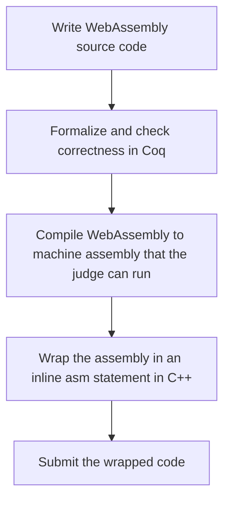

# WebAssembly
If we want to formalize real-world programs in Coq, we need to have a way to represent them in a formal language that Coq can understand. WebAssembly provides a natural way to do this, as it is a well-defined bytecode format with a formal specification that can be used to encode a wide range of programs.

With the power of WebAssembly, you can tackle even the toughest problems.

## Workflow

**Task:** Formalize WebAssembly now
